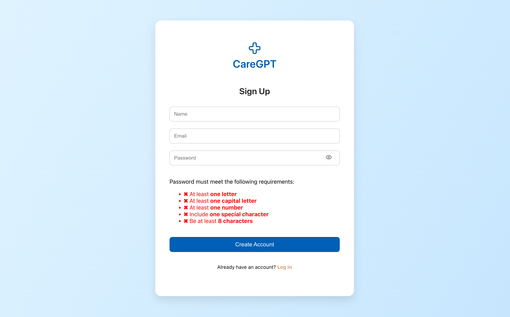
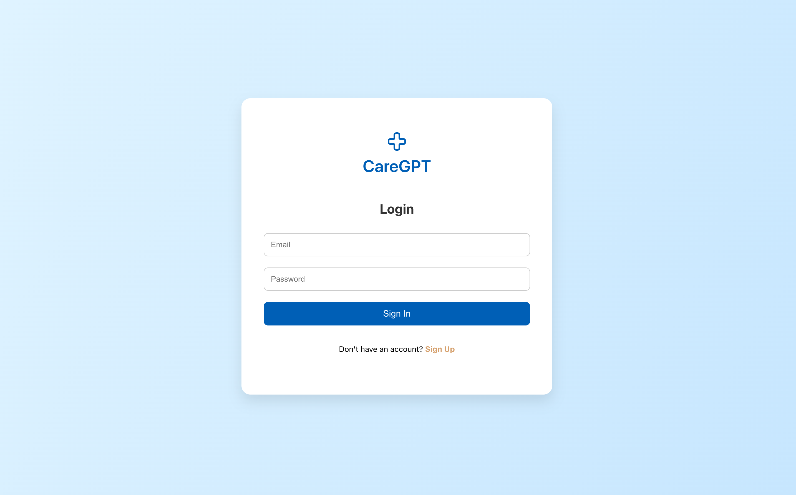
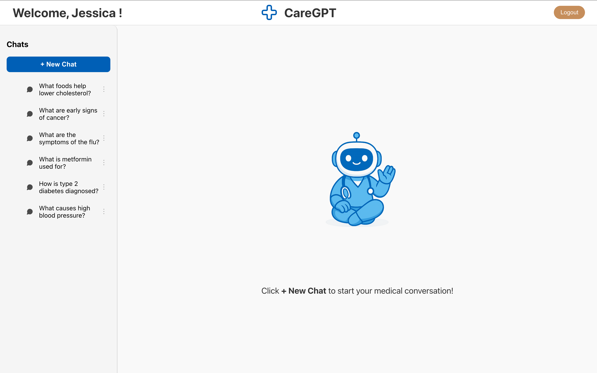
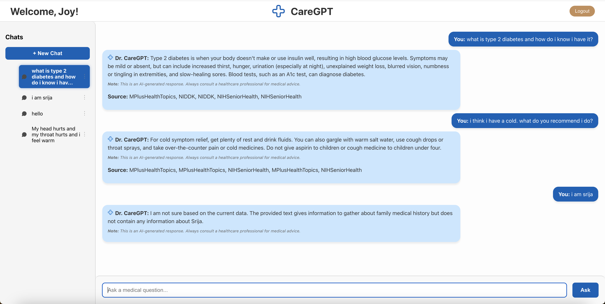

# CareGPT: A RuralHealthcareLLM

Northeastern University, Khoury College of Computer Science<br><br>

CS 6120 Natural Language Processing Project Proposal<br>
Srija Gadiraju, Hla Htoo, Vicki Diaz Rodas, and Xinjia Zhang<br>

GitHub Usernames: srijagadiraju | hlahtoo | Vickidiaz | oceliazhang<br>

Emails: gadiraju.sr@northeastern.edu | htoo.h@northeastern.edu | diazrodas.v@northeastern.edu | zhang.xinji@northeastern.edu<br>

## Project Links:

Deployed Site: https://ruralhealthcarellm.onrender.com/

Access Links to Public Dataset Used for This Project :

- Kaggle: https://www.kaggle.com/datasets/jpmiller/layoutlm/data
- GitHub: https://github.com/abachaa/MedQuAD

## Overview

CareGPT is a rural healthcare chatbot powered by Retrieval-Augmented Generation (RAG). It provides AI-generated, medically grounded responses to user queries, aiming to support individuals in underserved areas by delivering symptom explanations, possible diagnoses, and health maintenance guidance.

## Disclaimer

This project is intended for educational and research purposes only. The responses generated by our project CareGPT are powered by a language model and should not be considered professional medical advice.

Always consult a licensed healthcare provider for medical guidance, diagnosis, or treatment. The chatbot may occasionally provide inaccurate or outdated information, and the development team is not responsible for any decisions made based on its responses.

## Features

- **User Authentication**: Users can sign up and log in, with validation and token-based authentication.
- **AI-Powered Conversations (RAG)**: The chatbot delivers real-time, medically grounded answers using a Retrieval-Augmented Generation (RAG) pipeline.
- **Personalized Chat Sessions**: Each user has a private chat history, with all conversations saved and displayed upon login.
- **Chat Deletion**: Users have full control over their chat history and can delete individual sessions as needed.
- **Dynamic Session Titles**: Chat sessions are automatically renamed based on the user's first message for easier recall.
- **Automated Preprocessing Pipeline**: A custom Python pipeline cleans and chunks the MedQuAD dataset using BioBERT, preparing it for use in the retrieval process.

## Preprocessing Pipeline

- Scripts in the preprocessing/ folder:
  - clean.py: Removes HTML tags, whitespace, and lowercases text.
  - chunker.py: Tokenizes using BioBERT and splits into chunks.
  - main.py: Orchestrates full preprocessing pipeline.

To run pipeline do the following commands in roots directory:

```bash
   cd preprocessing
   python main.py
```

## Prerequisites

- Docker
- Docker Compose

## Setting Up With Docker

Before processing, ensure the Docker Desktop is installed and the Docker engine is running on your machine. You must have Docker running to build and launch the services using docker-compose. To run the fullstack app (frontend + backend) using Docker:

1. Clone this repo:

```bash
   git clone https://github.com/srijagadiraju/RuralHealthcareLLM.git
```

2. Navigate to the project directory:

```bash
   cd RuralHealthcareLLM
```

3. Create a .env file inside the backend/ folder and with the following variables:
   <br>Note: If a SECRET KEY is not defined, the system defaults to a fallback value of "supersecretkey". OK to continue, project will function the same.<br>

```bash
# backend/.env
MONGODB_URL=your_mongodb_connection_string
QDRANT_API_KEY=your_qdrant_api_key
QDRANT_URL=your_qdrant_url
GEMINI_API_KEY=your_gemini_api_key
```

4. Run the app:

```bash
docker build -t ruralhealthcare-app .
docker run -p 8000:8000 ruralhealthcare-app
```

```nginx
Backend API with frontend being served as static files→ http://localhost:8000
```

## Setting Up Project Locally Without Docker

1. Clone this repositry to your local machine

### Backend Setup

1. Open a terminal and navigate to the backend folder:
   ```bash
   cd backend
   ```
2. Create and activate a virtual environment:
   ```bash
   python3 -m venv venv
   source venv/bin/activate
   ```
3. Install the backend dependencies:

   ```bash
   pip install -r requirements.txt
   ```

4. Create a .env file inside the backend/ folder and with the following variables:
   <br>Note: If a SECRET KEY is not defined, the system defaults to a fallback value of "supersecretkey". OK to continue, project will function the same.<br>

```bash
# backend/.env
MONGODB_URL=your_mongodb_connection_string
SECRET_KEY=your_jwt_secret_key
QDRANT_API_KEY=your_qdrant_api_key
QDRANT_URL=your_qdrant_url
GEMINI_API_KEY=your_gemini_api_key
```

5. Run the FastAPI backend server:

   ```bash
   uvicorn app.main:app --reload
   ```

### Frontend Setup

1. Open a new terminal and navigate to the frontend folder:
   ```bash
   cd frontend
   ```
2. Install the frontend dependencies:
   ```bash
   npm install
   ```
3. Start the React application:

   ```bash
   npm start
   ```

   The application will now be running locally at:

   ```arduino
   http://localhost:3000
   ```

## Technologies Used

- **Frontend:** React.js, CSS, Lucide Icons

- **Backend:** FastAPI, Uvicorn, Pydantic

- **Database:** MongoDB Atlas

- **LLM Tools:** BioBERT (via HuggingFace), Transformers

- **Auth:** JWT with bcrypt

- **Preprocessing:** BeautifulSoup, Regex, Tokenizers
- **Containerization:** Docker, Docker Compose

## Screenshots

**SignUp Page**



**Login Page**



**Landing Page**



**Chat Interface**


